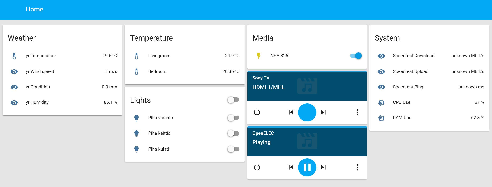

# home-assistant-setup
My setup for Home Assistant home automation platform

[secrets.yaml](https://home-assistant.io/topics/secrets/) file is not in this repo as it contains passwords, API keys etc. 

secrets.yaml sample:
```yaml
latitude: xxx
longitude: xxx
elevation: xxx
api_password: xxx
kodi_password: xxx
asuswrt_username: xxx
asuswrt_password: xxx
ifttt_key: xxx
```

## Devices

Lights:
* Philips Hue

Media Players: 
* Sony TV
* Kodi
* Chromecast
* Network Storage (Zyxel NSA)

Sensors:
* Arduino Weather Shield. Johnny Five is used to fetch data from the shield and local http server is used to serve data.
([GitHub project](https://github.com/ttu/arduino-weather-datahandler))

IFTTT:
* Light are triggered on and off based on weather.com sunset/sunrise time using IFTTT without Home Assistant. Could use [Sun trigger](https://home-assistant.io/getting-started/automation-trigger/#sun-trigger).



## Dev notes

### Debugging Home Assistant with VS Code

* Create default python debug launch.json configuration
* Open file homeassistant/__main__.py
* Press start debug
* Add --runner to launch.json's args, so windows won't execute process in subrocess and --open-ui if want frontend to be opened autmatically
```json
"args": ["--open-ui", "--runner"],
```

### Running tests on Vagrant

Vagrant synced folder has some problems with permissions, so copy home assistant folder before executing the tests.

```
cp -a /home-assistant/ /home/vagrant/
cd /home/vagrant/home-assistant/
tox
```